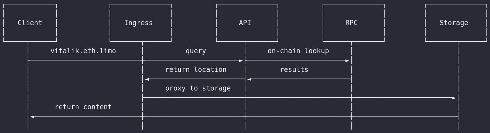

# [eth.limo](https://eth.limo) dWeb Gateway API

Backend service API for use with reverse proxies to deploy an HTTP [ENS](https://ens.domains) or [GNS](https://genomedomains.com/) gateway capable of resolving [IPFS](https://docs.ipfs.tech/), [IPNS](https://docs.ipfs.tech/how-to/publish-ipns/), [Arweave](https://www.arweave.org/), [Arweave Naming Service (ARNS)](https://docs.ar.io/arns/#overview), and [Swarm](https://www.ethswarm.org/) content.

Upstream proxies can forward ENS and GNS hostnames for resolution and properly route them to the appropriate storage gateway path and destination via the following response headers:

IPFS example:
```
X-Content-Location: ${cid}.ipfs.dweb.link
X-Content-Path: /
X-Content-Storage-Type: ipfs-ns
```

__Gateway request flow__



### Configuration

| Environment Variable        | Default           | Purpose  |
| ------------- |:-------------:| -----:|
| `LISTEN_PORT`     | `8888` | Proxy API listener port. |
| `IPFS_SUBDOMAIN_SUPPORT`     | `"false"` | Return IPFS gateway destination in subdomain format, i.e. `${cid\|peerId}.${ipfs\|ipns}.dweb.link`. Otherwise results are returned as `dweb.link/ipfs/${cid}`. |
| `IPFS_AUTH_KEY`     | `null` | Basic authentication for `IPFS_KUBO_API_URL`. |
| `IPFS_KUBO_API_URL` | `undefined` | URL to Kubo `/api/v0/name/resolve` service. This setting performs IPNS name resolution and PeerId conversion to CIDv1 identifiers during the contentHash lookup process. Note, this does not enable or disable IPNS support (as this is performed by the IPFS backend) but rather attempts to use resolved CID values as cache keys as opposed to peerIds. Please read the official IPFS [documentation](https://docs.ipfs.tech/reference/kubo/rpc/#api-v0-name-resolve) for more information. |
| `ARWEAVE_TARGET`     | `"https://arweave.net"` | Arweave gateway FQDN. |
| `SWARM_TARGET`     | `"https://api.gateway.ethswarm.org"` | Swarm gateway FQDN. |
| `IPFS_TARGET` | `http://127.0.0.1:8080` | FQDN of IPFS gateway backend to use for requests. |
| `REDIS_URL`     | `"redis://127.0.0.1:6379"` | Redis server endpoint. |
| `CACHE_TTL`     | `"300"`      |   TTL to persist resolved records |
| `ASK_ENABLED` | `"false"`      |    Whether to spawn a special listener for responding to 
| `ASK_LISTEN_PORT` | `"9090"`      |    Ask listener port. |certificate issuance requests from Caddy server: `:9090/ask?domain=${name}.eth`. |
| `ETH_RPC_ENDPOINT` | `"http://192.168.1.7:8845"` | Primary RPC provider FQDN for ENS resolution. |
| `ETH_RPC_ENDPOINT_FAILOVER_PRIMARY` | `null` | Secondary failover RPC provider FQDN. |
| `GNO_RPC_ENDPOINT` |  `https://rpc.gnosischain.com` | Primary RPC endpoint for Gnosis. |
| `DOMAINSAPI_ENDPOINT` | `null` | API endpoint for custom domain routing logic. Can be set to any endpoint that returns a `200` if you do not need this feature. |
| `LOG_LEVEL` | `"info"` | Set the logging level. |
| `LIMO_HOSTNAME_SUBSTITUTION_CONFIG` | `{ "eth.limo": "eth", "eth.local": "eth", "gno.limo": "gno", "gno.local": "gno" }` | The domains and services corresponding to each domain name for gateway operations. When set via an environment variable, this must be a base64 encoded JSON object. |
| `DOMAIN_TLD_HOSTNAME` | `"eth"` | Subdomain to use with gateway (naming service dependent). For example, `ens.eth.limo`. Contingent upon the setting of `DOMAIN_TLD` for gateway operations. |
| `DNSQUERY_ENABLED` | `"true"` | Enable DNS over HTTPS (DoH) listener. |
| `DNSQUERY_LISTEN_PORT` | `"11000"` | Listener port for DoH. |
| `PURGE_CACHE_ON_START` | `"false"` | Indicates whether to purge the entire Redis cache upon server startup. |
| `PURGE_CACHE_COUNT` | `"20000"` | Number of keys to purge if `PURGE_CACHE_ON_START` is enabled. |
| `PURGE_CACHE_PATTERN` | `"*.${DOMAIN_TLD_HOSTNAME}"` | Key pattern to purge if `PURGE_CACHE_ON_START` is enabled. |

### Local Example

1. Start Redis

```
podman run -p 127.0.0.1:6379:6379 docker.io/library/redis
```

2. Configure the necessary environment listed above

3. Start dWeb Proxy API

```
npm install
npm run dev
```

4. Make a request

```shell
$ curl http://localhost:8888 -H 'Host: ens.eth' -sD - -o /dev/null

HTTP/1.1 200 OK
X-Powered-By: Express
X-Content-Location: k51qzi5uqu5dipklqpo2uq7advlajxx5wxob0mwyqbxb5zu4htblc4bjipy834.ipns.dweb.link
X-Content-Path: /
X-Content-Storage-Type: ipns-ns
Date: Fri, 29 Mar 2024 17:11:14 GMT
Connection: keep-alive
Keep-Alive: timeout=5
Transfer-Encoding: chunked
```

__Use with Caddy server as a local gateway__

Start `dweb-proxy-api` with the correct environment variables and install [Caddy server](https://github.com/caddyserver/caddy).

Use the following `Caddyfile` configuration (localhost example):

```
{
	admin off
	auto_https off

	local_certs

	log {
		level DEBUG
		format console
	}
}

&(dweb-api) {
	reverse_proxy localhost:8888 {
		transport http

		method GET
		header_up Host (.*[-a-z0-9]+\.eth) $1

		@proxy status 200
		handle_response @proxy {
			@trailing vars_regexp trailing {rp.header.X-Content-Path} ^(.*)/$
			reverse_proxy @trailing {rp.header.X-Content-Location} {
				rewrite {re.trailing.1}{uri}
				header_up Host {rp.header.X-Content-Location}
				header_up -X-Forwarded-Host

				transport http {
					dial_timeout 2s
				}

				@redirect301 status 301
				handle_response @redirect301 {
					redir {rp.header.Location} permanent
				}
			}
		}
	}
}

:8443 {
	log {
		level INFO
		format console
	}

	bind 0.0.0.0

	tls internal {
		on_demand
	}

	invoke dweb-api
}
```

You can use this `Caddyfile` as a starting point for more advanced configurations, however this is sufficient for use as a local gateway (you may wish to use port 443 instead of 8443).

Depending on your environment, either edit `/etc/hosts` or configure a stub-resolver for `systemd-resolved` (this will let you route all `eth.` queries to your local gateway).

For example, using `/etc/hosts`:

```
127.0.0.1   localhost ens.eth
::1         localhost ens.eth
```

Save the file, launch Caddy (`caddy run`) and then open a browser and navigate to `https://ens.eth:8443`.