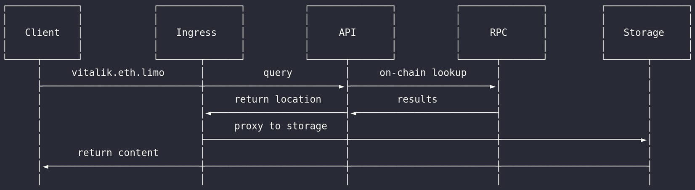

# ENS dWeb Gateway API

Backend service API for use with reverse proxies to deploy an HTTP [ENS](https://ens.domains)/[GNS](https://genomedomains.com/) gateway capable of resolving [IPFS](https://docs.ipfs.tech/), [IPNS](https://docs.ipfs.tech/how-to/publish-ipns/), [Arweave](https://www.arweave.org/), [Arweave Name System (ArNS)](https://docs.ar.io/arns/#overview), and [Swarm](https://www.ethswarm.org/) content.

Upstream proxies can forward ENS and GNS hostnames for resolution and properly route them to the appropriate storage gateway path and destination via the following response headers (IPFS example below):

```
X-Content-Location: ${cid}.ipfs.dweb.link
X-Content-Path: /
X-Content-Storage-Type: ipfs-ns
```

✅ ENSv2 ready

__Gateway request flow__



## Configuration

| Environment Variable        | Default           | Description  |
| ------------- |:-------------:| -----:|
| `LISTEN_PORT`     | `8888` | Proxy API listener port. |
| `IPFS_SUBDOMAIN_SUPPORT`     | `"false"` | Return IPFS gateway destination in subdomain format, i.e. `${cid\|peerId}.${ipfs\|ipns}.dweb.link`. Otherwise results are returned as `dweb.link/ipfs/${cid}`. Note that dweb.link is just an example and not a default value in this context. Please see `IPFS_TARGET` for more information.|
| `IPFS_AUTH_KEY`     | `null` | Basic authentication for `IPFS_KUBO_API_URL`. |
| `IPFS_KUBO_API_URL` | `undefined` | URL to Kubo `/api/v0/name/resolve` service. This setting performs IPNS name resolution and PeerId conversion to CIDv1 identifiers during the contentHash lookup process. Note, this does not enable or disable IPNS support (as this is performed by the IPFS backend) but rather attempts to use resolved CID values as cache keys as opposed to peerIds. Please read the official IPFS [documentation](https://docs.ipfs.tech/reference/kubo/rpc/#api-v0-name-resolve) for more information. |
| `ARWEAVE_TARGET`     | `"https://arweave.net"` | Arweave gateway FQDN. |
| `SWARM_TARGET`     | `"https://api.gateway.ethswarm.org"` | Swarm gateway FQDN. |
| `IPFS_TARGET` | `http://localhost:8080` | FQDN of IPFS gateway backend to use for requests. |
| `REDIS_URL`     | `"redis://127.0.0.1:6379"` | Redis server endpoint. |
| `CACHE_TTL`     | `"300"`      |   TTL to persist resolved records |
| `ASK_ENABLED` | `"false"`      |    Whether to spawn a special listener for responding to 
| `ASK_LISTEN_PORT` | `"9090"`      |    Ask listener port. |certificate issuance requests from Caddy server: `:9090/ask?domain=${name}.eth`. |
| `ETH_RPC_ENDPOINT` | `"http://192.168.1.7:8845"` | Primary RPC provider FQDN for ENS resolution. |
| `ETH_RPC_ENDPOINT_FAILOVER_PRIMARY` | `null` | Secondary failover RPC provider FQDN. |
| `GNO_RPC_ENDPOINT` |  `https://rpc.gnosischain.com` | Primary RPC endpoint for Gnosis. |
| `DOMAINSAPI_ENDPOINT` | `null` | API endpoint for custom domain routing logic. Can be set to any endpoint that returns a `200` if you do not need this feature. |
| `LOG_LEVEL` | `"info"` | Set the logging level. |
| `LIMO_HOSTNAME_SUBSTITUTION_CONFIG` | `{ "eth.limo": "eth", "eth.local": "eth", "gno.limo": "gno", "gno.local": "gno" }` | The domains and services corresponding to each domain name for gateway operations. When set via an environment variable, this must be a base64 encoded JSON object. |
| `DOMAIN_TLD_HOSTNAME` | `"eth"` | Subdomain to use with gateway (naming service dependent). For example, `ens.eth.limo`. Contingent upon the setting of `DOMAIN_TLD` for gateway operations. |
| `DNSQUERY_ENABLED` | `"true"` | Enable DNS over HTTPS (DoH) listener. |
| `DNSQUERY_LISTEN_PORT` | `"11000"` | Listener port for DoH. |
| `PURGE_CACHE_ON_START` | `"false"` | Indicates whether to purge the entire Redis cache upon server startup. |
| `PURGE_CACHE_COUNT` | `"20000"` | Number of keys to purge if `PURGE_CACHE_ON_START` is enabled. |
| `PURGE_CACHE_PATTERN` | `"*.${DOMAIN_TLD_HOSTNAME}"` | Key pattern to purge if `PURGE_CACHE_ON_START` is enabled. |
| `SW_BUNDLE_PUBLIC_URL` | `""` | Optional value if using service workers instead of the API. Set this to the parent wildcard domain you will be serving traffic from, i.e. setting this value to `eth.example.com` would support `ens.eth.example.com`, etc.  |
| `SERVICE_WORKER_TRUSTLESS` | `"false"` | Optional value if using service workers instead of the API. Set this to `"true"` to enable [trustless IPFS gateway mode](https://specs.ipfs.tech/http-gateways/trustless-gateway/). You must also set `IPFS_TARGET` to the hostname of a gateway running in trustless mode.   |
| `CLUSTER_WORKERS` | `1` | Number of worker processes to fork. Set to the number of vCPUs on your host (or container CPU limit). |
| `CLUSTER_MAX_INFLIGHT` | `300` | Maximum concurrent in-flight requests per worker before the overload circuit opens. |
| `CLUSTER_MAX_LAG_MS` | `750` | Event-loop P99 lag threshold (measured every heartbeat). Overload detection fires only when **both** `maxInflight` AND `maxLagMs` are exceeded simultaneously. |
| `CLUSTER_OVERLOAD_GRACE_MS` | `8000` | Milliseconds a worker may remain in the overloaded state before it exits. Gives the load balancer time to route new connections elsewhere. |
| `CLUSTER_NO_HEARTBEAT_MS` | `5000` | If no heartbeat is received from a worker within this window, the primary sends `SIGKILL` to the stuck worker. |
| `CLUSTER_CATASTROPHIC_RESTARTS` | `10` | If this many workers exit (for any reason) within `CLUSTER_CATASTROPHIC_WINDOW_MS`, the primary calls `process.exit(1)`. |
| `CLUSTER_CATASTROPHIC_WINDOW_MS` | `30000` | ms | Rolling time window used by the catastrophic-restart detector. |
| `DATAURL_ENABLED` | `"false"` | Enable [EIP-8121](https://eips.ethereum.org/EIPS/eip-8121) with [ENSIP-TBD](https://github.com/nxt3d/ENSIP-ideas/blob/main/ENSIPS/ensip-TBD-2.md) [hook](https://github.com/ethlimo/ens-hooks) support |
| `DATAURL_PORT` | `12500` | TCP port to bind on |
| `DATAURL_ENDPOINT` | (unset) | URL of the [EIP-8121](https://eips.ethereum.org/EIPS/eip-8121) hook execution endpoint. Required if `DATAURL_ENABLED=true`. |

## Quickstart

1. Start Redis (using any method)

```
podman pull docker.io/library/redis
podman run --net=host docker.io/library/redis
```

(Note you can also use `docker` instead of `podman`)

2. Configure the necessary environment variables listed above

3. Start the ENS dWeb Proxy API

```
./bin/build.sh

# (optional) run test suites
npm run test

./bin/runDev.sh
```

4. Make a request

```shell
$ curl http://localhost:8888 -H 'Host: ens.eth' -sD - -o /dev/null

HTTP/1.1 200 OK
X-Content-Location: k51qzi5uqu5dipklqpo2uq7advlajxx5wxob0mwyqbxb5zu4htblc4bjipy834.ipns.dweb.link
X-Content-Path: /
X-Content-Storage-Type: ipns-ns
...
```

### Container example

```
podman pull docker.io/library/redis
podman run --net=host docker.io/library/redis

buildah bud -t dweb-api-proxy .

# Make sure to pass the necessary environment variables with "-e" flags
podman run --rm -it --net=host -e "ETH_RPC_ENDPOINT=${ETH_RPC_ENDPOINT}" dweb-api-proxy
```

(Note you can also use `docker` instead of `buildah`)

### Running a local gateway

Please see the [local gateway README](./local_gateway/README.md) for instructions on how to run your own fully local ENS/dWeb gateway instance.

## Service Workers

All static assets for supporting service worker resolution are located in `packages/dweb-api-serviceworker/dist`. We recommend using an HTTP server such as Caddy or Nginx to serve this content (any CDN will work as well). The `SW_BUNDLE_PUBLIC_URL` environment variable should be set to the domain you will be serving traffic from. For example, if you are serving traffic from `*.eth.example.com`, set `SW_BUNDLE_PUBLIC_URL` to `eth.example.com` in order to resolve `ens.eth.example.com`.